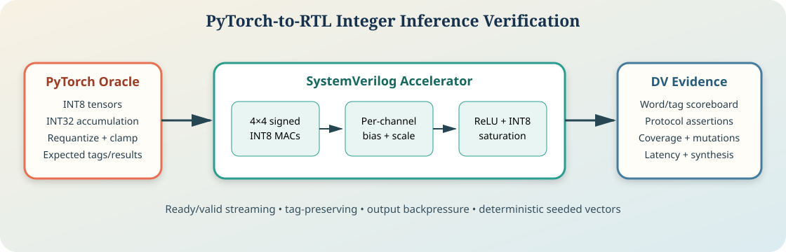
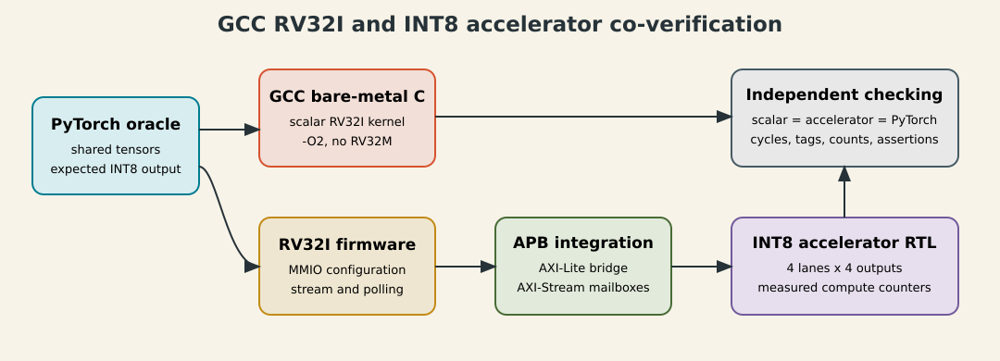
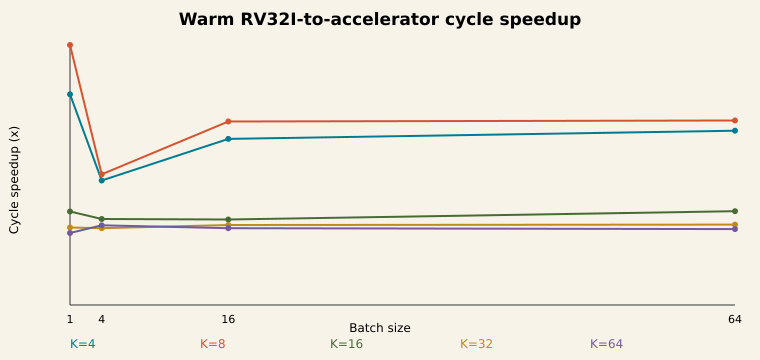

# Tiled INT8 Tensor Accelerator RTL and PyTorch DV

A command-driven quantized linear-layer accelerator implemented in SystemVerilog and checked bit-for-bit against PyTorch. The engine executes configurable `K=4–64` dot products over four output channels, supports double-buffered parameters and asymmetric quantization, and preserves tagged results through a four-entry output FIFO.



## Why This Project

This project is the portfolio's ML/datapath example. It shows how a PyTorch model becomes an explicit integer numerical contract, how that contract maps into multicycle RTL, and how numerical, protocol, performance, and implementation behavior are independently verified.

## Measured Evidence

<!-- BEGIN GENERATED METRICS -->
| Evidence | Result |
| --- | ---: |
| PyTorch-to-RTL comparisons | `130 / 130` |
| Functional coverage | `64 / 64` |
| Interaction crosses | `48 / 48` |
| Two-layer PyTorch/RTL chain | `PASS` |
| Measured steady-state throughput | `0.500 vectors/cycle` |
| Protocol edge checks | `15 / 15` |
| Portable packed-vector checks | `6 / 6` |
| AXI/record integration tests | `3 / 3` |
| AXI/record integration coverage | `17 / 17` |
| Named assertions | `21` |
| Portable monitor assertions | `3` |
| AXI wrapper assertions | `5` |
| RTL mutations detected | `9 / 9` |
| Formal safety/cover groups | `2 / 2` |
| Raw line coverage | `159 / 173 (91.91%)` |
| Reviewed executable line coverage | `159 / 159 (100.00%)` |
| Raw branch/expression coverage | `NA (Verilator 5.020 LCOV)` |
| Yosys synthesis proxy | `PASS` |
| RV32I/accelerator benchmark matrix | `40 / 40` |
| RV32I/accelerator correctness | `25 / 25` |
| RV32I/accelerator backpressure | `15 / 15` |
| RV32I benchmark mutations | `5 / 5` |
<!-- END GENERATED METRICS -->

See [project metrics](docs/project_metrics.md), the [verification plan](docs/verification_plan.md), and the [two-layer PyTorch demonstration](docs/pytorch_mlp_demo.md).

## RV32I Hardware/Software Benchmark



An optional integration lane runs GCC `-O2` bare-metal C on a checksum-locked
RV32I/Zicsr core snapshot. Firmware evaluates each quantized layer twice: first
with a scalar software kernel, then by programming this accelerator through APB
to AXI-Lite and streaming activations through MMIO-to-AXI-Stream mailboxes.
Both result sets must match the same PyTorch-generated vectors bit-for-bit before
any performance row is accepted.

The checked-in evidence closes `40 / 40` cold/warm geometry points, `25 / 25`
operand-pattern checks, `15 / 15` backpressure cases, and `5 / 5` expected-fail
mutations. See the [measured benchmark summary](reports/rv32_accel_benchmark_summary.md).



## Architecture

- Four signed INT8 activation lanes and four output channels in the reviewed baseline.
- Configurable `K=4/8/16/32/64`, processed four activation/weight pairs per output each active cycle.
- Two complete weight/quantization banks; the inactive bank can be configured while the active bank executes.
- Signed INT32 accumulation with per-channel bias.
- Per-channel multiplier, round-to-nearest right shift, output zero point, ReLU, and INT8 saturation.
- Asymmetric input and per-output weight zero points.
- Command validation, tagged streaming chunks, and a four-entry output FIFO.
- Optional AXI-Lite control, AXI-Stream activation/result, and packed-record integration wrappers.
- A parameterized `8×8` structural variant used for synthesis-cost comparison.

The exact behavior is defined in the [numerical contract](docs/numerical_contract.md).

## Verification Flow

1. PyTorch generates 30 directed and 100 seeded-random workloads.
2. The independent model predicts adjusted operands, INT32 accumulators, signed rounded requantization, and final INT8 outputs.
3. The SystemVerilog bench loads either parameter bank, issues a tagged command, and streams every activation chunk.
4. Every RTL result word and tag is compared exactly; floating-point tolerance is never used for RTL checking.
5. A two-layer `Linear(16,4)-ReLU-Linear(4,4)` model feeds RTL-observed hidden activations into the second RTL layer.
6. Assertions, protocol-edge tests, functional/cross coverage, RTL mutations, bounded formal checks, code coverage, performance, and synthesis reports are regenerated.
7. A packed transaction stream and synthesizable health monitor provide the same command/result contract for simulation now and a future FPGA host later.

## Reviewer Quick Path

```bash
make project-check PYTHON=/path/to/pytorch/python
make release-check PYTHON=/path/to/pytorch/python
make portable-check # packed records plus a synthesizable protocol/performance monitor
make axi-integration-check # AXI-Lite, AXI-Stream, decoder, and end-to-end transport checks
make rv32-benchmark-smoke # GCC firmware, RV32I, APB/AXI, stream, and PyTorch check
make rv32-benchmark-release-check # optional 40+25+15 matrix and mutations
```

High-signal evidence:

- [PyTorch/RTL comparison](reports/rtl_vs_pytorch_summary.csv)
- [Two-layer RTL chain](reports/pytorch_mlp_rtl_summary.csv)
- [Functional coverage](reports/functional_coverage.csv)
- [Interaction crosses](reports/cross_coverage.csv)
- [RTL mutation sensitivity](reports/mutation_summary.csv)
- [Performance characterization](docs/performance.md)
- [Formal evidence](docs/formal.md)
- [Synthesis comparison](docs/synthesis.md)
- [Portable validation and FPGA readiness](docs/fpga_readiness.md)
- [AXI and packed-record integration](docs/axi_integration.md)
- [RV32I hardware/software benchmark](docs/rv32_accelerator_benchmark.md)

## Repository Layout

```text
rtl/       synthesizable tiled accelerator RTL
sim/       SystemVerilog benches and bound assertions
formal/    reduced-geometry safety and reachability tasks
portable/  versioned packed command/result vectors for simulation or a future FPGA host
scripts/   PyTorch export, regression, coverage, mutation, and report automation
docs/      reviewer-facing architecture and verification evidence
reports/   normalized checked-in CSV results
integration/rv32_offload/  optional GCC/RV32I hardware-software benchmark lane
```

## Limitations

- This is a compact linear-layer engine, not a complete NPU, systolic array, training engine, or software compiler.
- RV32I speedups are behavioral same-clock cycle ratios against a scalar `-O2` software kernel. They are not Verilator wall time, silicon frequency, FPGA throughput, power, or implementation signoff.
- The reviewed functional regression uses the `4×4` baseline; `8×8` is separately reported synthesis evidence.
- No convolution frontend, floating point, sparsity, stochastic rounding, or DMA is included. The optional AXI-Lite/AXI-Stream wrapper is a bounded integration contract, not protocol certification.
- UVM is intentionally not duplicated; the portfolio's AXI4 QoS fabric owns the reusable UVM/VIP story.
- PyTorch, Verilator, SymbiYosys, and Yosys results are open-source pre-silicon evidence, not accuracy certification or physical-design signoff.
