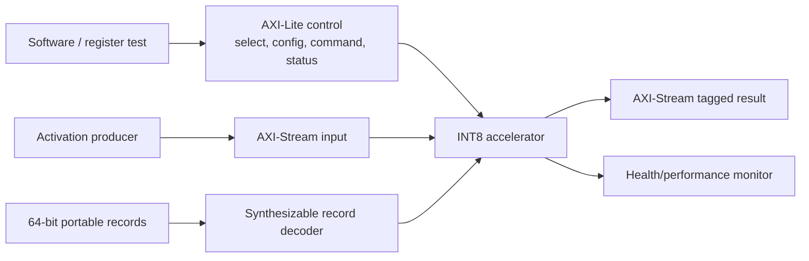

# AXI and Packed-Record Integration

The optional transport layer keeps the numerical accelerator unchanged while adding two practical integration paths.

## AXI-Lite Register Contract

| Offset | Access | Purpose |
| --- | --- | --- |
| `0x00` | RW | configuration selector: kind, bank, output, index |
| `0x04` | W | configuration data and commit |
| `0x08` | W | command bank, K, and tag |
| `0x0c` | R | readiness, output-valid, and sticky-error status |
| `0x10–0x20` | R | accepted, completed, chunks, output stalls, bank swaps |
| `0x24` | R | sticky error |
| `0x28` | W1C | clear sticky error |

The slave accepts independent AW and W arrival, waits for the native configuration/command handshake before responding, rejects partial, unaligned, and unmapped accesses with `SLVERR`, and exposes no burst behavior. AXI-Stream carries one four-lane activation chunk and one tagged four-output result per transfer.

## Verification Evidence

`make axi-integration-check` executes:

- AXI-Lite simultaneous, AW-first, and W-first writes.
- Parameter and command programming through the wrapper.
- AXI-Stream input plus result backpressure and payload stability.
- Performance/status reads, partial writes, invalid addresses, unaligned reads, sticky error, and W1C recovery.
- Unit decoding of configuration, command, activation, stall, expectation, malformed, and end records.
- End-to-end replay of all portable vectors through `int8_portable_accel_top`.

Canonical results are in `reports/axi_stream_integration_summary.csv`. The separate `reports/axi_stream_integration_coverage.csv` records 17 event-derived points spanning write ordering, error responses, stream backpressure, register observability, every packed-record class, and full replay. This is open-source integration evidence, not AXI protocol certification or FPGA hardware validation.
