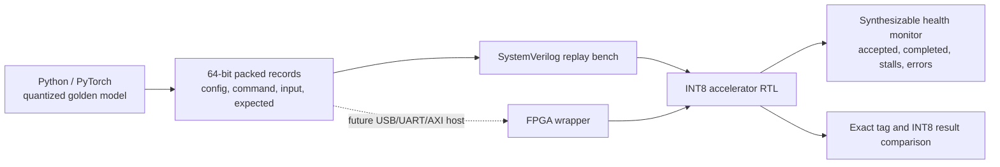

# Portable Validation and FPGA Readiness

The project does not claim physical FPGA execution yet. It now isolates the work that can be completed and verified before a board is selected: a transport-neutral vector format, a synthesizable runtime monitor, deterministic golden results, and a single replay command.

## What Is Executable Today

- `make portable-check` regenerates a versioned packed stream and executes it against RTL.
- Six deterministic workloads exercise `K=4/8/16`, both parameter banks, signed operands, zero points, ReLU, saturation behavior, and output stalls.
- JSON metadata records schema version, seed, record count, and SHA-256 digest.
- `int8_accel_health_monitor` is synthesizable and records command, chunk, completion, and stall counts, maximum outstanding work, and sticky protocol errors.
- Assertions require completions not to exceed accepted commands and preserve the result tag under backpressure.

## Board-Dependent Work Still Required

A physical release still needs a board-specific clock/reset wrapper, host transport such as AXI-Lite plus AXI-Stream or UART, pin/timing constraints, Vivado implementation, bitstream generation, and on-board comparison/ILA capture. Until those exist, this is **FPGA-ready collateral**, not FPGA validation evidence.

The record layout is specified in [`portable/README.md`](../portable/README.md), and canonical results are checked in as `reports/portable_validation_summary.csv`.
