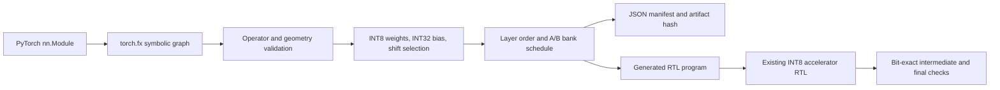

# PyTorch FX Graph Compiler

This optional lane moves beyond hand-authored layer vectors. It uses `torch.fx.symbolic_trace` to inspect a PyTorch module, validates the supported graph, quantizes every `Linear` layer, fuses following `ReLU` operations, schedules alternating parameter banks, and emits both a JSON compilation manifest and SystemVerilog data consumed by the existing accelerator testbench.

## Supported Contract

- One to three `torch.nn.Linear` layers.
- Four output channels per layer; input dimensions `4`, `8`, `16`, `32`, or `64`.
- Optional `torch.nn.ReLU` immediately following a linear layer.
- Per-layer symmetric weight quantization, integer bias conversion, and ties-away-from-zero shift rounding matching the RTL numerical contract.
- Alternating parameter-bank scheduling, including bank reuse for a third layer.

Other modules and functional operators are rejected. The checked negative case verifies that `sigmoid` cannot silently enter the accelerator program.

## Evidence

`make fx-compiler-check` compiles 20 deterministic graphs spanning one, two, and three layers and input widths 4, 8, and 16. Four inputs per graph execute through RTL. The current report records `20 / 20` compiled graphs, `624` bit-exact intermediate/final output words, and `10 / 10` compiler coverage points.

The [compilation manifest](../reports/fx_graph_manifest.json) preserves FX nodes, seeds, layer geometry, activation fusion, bank assignment, quantization shifts, PyTorch version, and an artifact hash. [RTL results](../reports/fx_rtl_summary.csv) and [compiler coverage](../reports/fx_coverage.csv) are separate from the canonical 130-scenario accelerator closure.

This is a deliberately small compiler for the documented accelerator contract, not a general PyTorch backend or TorchInductor replacement.
