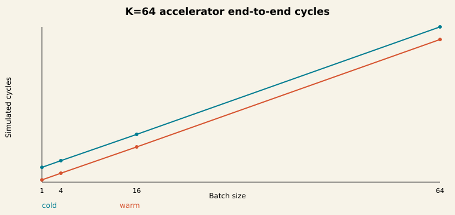
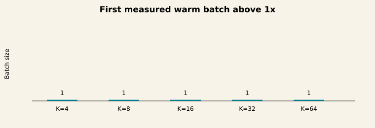
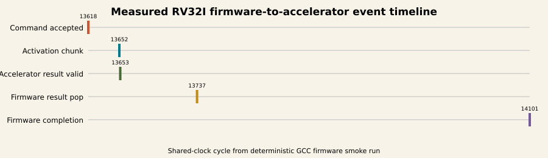

# RV32I versus INT8 Accelerator Benchmark

This optional lane demonstrates software-driven accelerator use and measures the
benefit of moving a quantized linear layer out of scalar RV32I software.


## Data Flow

```text
PyTorch vector generator
    |-- C tensor header --> GCC RV32I firmware --> scalar kernel
    |                                      |----> APB MMIO
    |                                      v
    |                              APB-to-AXI-Lite control
    |                              APB/AXI-Stream mailboxes
    |                                      |
    `-- expected INT8 outputs ------------>+--> INT8 accelerator
```

The CPU and accelerator share one simulated clock. The CPU configures weights,
biases, zero points, multipliers, shifts, and activation policy through AXI-Lite,
then pushes tagged four-byte activation chunks and polls tagged results. A
freestanding scalar C implementation uses the identical integer contract.

## Measurement Contract

- Scalar cycles cover kernel entry through the final output.
- Warm accelerator cycles include streaming, polling, and result reads but reuse configuration.
- Cold accelerator cycles additionally include weight and quantization programming.
- Compute-only latency stops when the result first becomes valid, before software polling delay.
- Retired instruction counts and shared-clock cycles are captured by verification markers around each region.
- Counter-read overhead is sampled 32 times and the median is recorded with raw results.

The benchmark does not add RV32M. GCC links repository-provided RV32I multiply and
64-bit shift helpers. The build fails on unresolved runtime symbols.

## Evidence

- [Measured summary](../reports/rv32_accel_benchmark_summary.md)
- [40-row cold/warm matrix](../reports/rv32_accel_benchmark.csv)
- [25-row numerical matrix](../reports/rv32_accel_correctness.csv)
- [15-row backpressure matrix](../reports/rv32_accel_backpressure.csv)
- [Five mutation detections](../reports/rv32_accel_mutations.csv)








These are deterministic behavioral Verilator cycle measurements. They do not
represent host simulation speed, FPGA or silicon frequency, physical power, or
implementation signoff.
